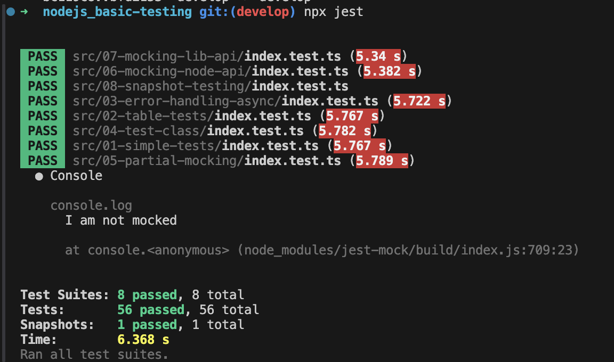

# Basic testing

This repository demonstrates the use of Jest to test Node.js functions and classes while mocking Node.js APIs and libraries.

### Installation and usage
1. run `git clone https://github.com/mlatysheva/nodejs_basic-testing.git` to clone the repository to your computer.
2. run `npm i` to install all dependencies
3. run `npm run test` to run the tests
  - run `npm run test:verbose` to run the tests with additional details

In total 56 tests were written.

### **Simple tests**

Unit tests for the `simpleCalculator` function, which performs basic mathematical operations - addition, subtraction, division, multiplication, and exponentiation. The tests verify that the operations are executed correctly and that the function returns `null` for invalid input.

The tests are in `src/01-simple-tests/index.test.ts`.

---

### **Table tests**

The tests written in the previous task are re-written using the table-driven testing approach, utilizing the appropriate Jest API.

The tests are in `src/02-table-tests/index.test.ts`.

---

### **Error handling & async**

The functions that work asynchronously/throw/reject exceptions are tested.

The tests are in `src/03-error-handling-async/index.test.ts`.

---

### **Testing class**

The tests check the class representing a bank account that implements corresponding operations. The following aspects have been taken into account: some methods of the class invoke others, some operations result in errors, and the implementation is asynchronous and involves the native JS API. 

The tests are in `src/04-test-class/index.test.ts`.

---

### **Partial mocking**

The Jest API is utilized to partially mock the contents of a module.

The tests are in `src/05-partial-mocking/index.test.ts`.

---

### **Mocking Node.js API**

The proper usage of the Node.js API based on commonly used APIs such as the `fs` module, as well as `setTimeout` and `setInterval` is tested. The tests do not interact with the actual file system and do not rely on real-time!

The tests are in `src/06-mocking-node-api/index.test.ts`.

---

### **Mocking library API**

The tests check that function that utilizes library APIs works correctly (with commonly used libraries such as `axios` and `lodash` as examples).

The tests are in `src/07-mocking-lib-api/index.test.ts`.

---

### **Snapshot testing**

Snapshot testing is used with Jest to compare it to regular comparison testing.

The tests are in `src/08-snapshot-testing/index.test.ts`.
